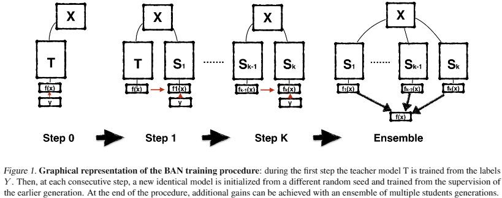
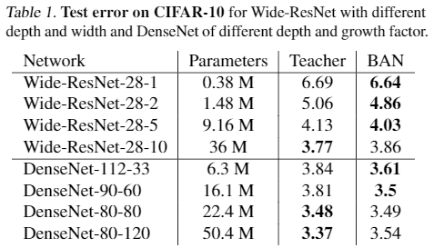
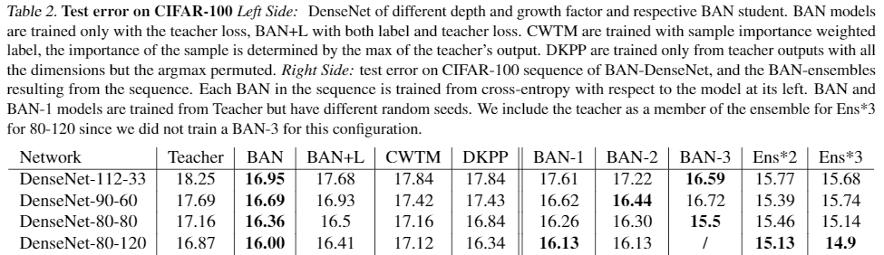
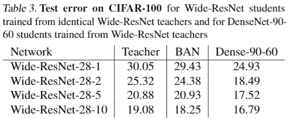

## 概要

* モデル圧縮で用いられるKnowledge Distillation (KD)において，teacherとstudentに同一のモデルを使用するBorn-Again Networks (BANs)を提案．
* BANによって学習したstudentがteacherの性能を超えることをVisionおよびLanguageのタスクで実験的に確認した．

## BANの学習手順

BANの学習手順の概要図は以下の通り．

Image Classificationのタスクを想定してBANの学習手順を見ていく．
学習データセットの画像・ラベルのペアを$(x, y) \in \mathcal{X} \times \mathcal{Y}$とすると，学習するモデルは$f(x): \mathcal{X} \rightarrow \mathcal{Y}$である．
パラメータ$\theta_1$を持つネットワークを考えると，最適なパラメータ$\theta_1^{\\ast}$は損失関数$\mathcal{L}$を最小化することで得られる．
\begin{align}
\theta_1^{\\ast} = \argmin_{\theta_1} \mathcal{L} (y, f(x, \theta_1)).
\end{align}
$\theta^{\\ast}$持つネットワークをteacherとして，次にパラメータ$\theta_2$を持つstudentを学習する際の損失関数を以下のように考える．
\begin{align}
\mathcal{L}(f(x, \argmin_{\theta_1} \mathcal{L} (y, f(x, \theta_1))), f(x, \theta_2)).
\end{align}

更に，[SGDR](https://arxiv.org/abs/1608.03983)の発想を用いて，複数のモデルによるアンサンブルを考える．$k-1$のstudentから$k$のstudentへのKDを以下の損失関数によって表す．
\begin{align}
\mathcal{L}(f(x, \argmin_{\theta_{k-1}} \mathcal{L} (y, f(x, \theta_1))), f(x, \theta_k)).
\end{align}
アンサンブルでは$k$個のモデルの予測平均を用いる．
\begin{align}
\hat{f}^k (x) = \sum_{i = 1}^k f(x, \theta_i) / k
\end{align}

実際に，teacherからstudentへのKDはlogitsの差を勾配とすることで実現する（つまり，teacherとstudentの出力層にでのsoftmaxの差を勾配にしている）．
即ち，teacherとstudentのlogitをそれぞれ$t_j, z_j$とすると以下のように表せる．
\begin{align}
\frac{\partial \mathcal{L}\_i}{\partial z_i} = q_i - p_i = \frac{e^{z_i}}{\sum_{j = 1}^n e^{z_j}} - \frac{e^{t_i}}{\sum_{j = 1}^n e^{t_j}}
\end{align}
最初にteacherを学習する際は，$t_j$がone-hotで表現されたベクトルの$j$番目だとみなせば，一貫して上記の式で表現できる．

上式により，studentを学習する際はteacherとの出力の差を見て学習することになる．
この発想はおそらく以下の内容からきたものと思われる．

> The authors in (Hinton et al., 2015 ) suggest that the success of KD depends on the dark knowledge hidden in the distribution of logits of the wrong responses, that carry information on the similarity between output categories.

## 実験結果

実験結果については前半までしか読んでないのに簡単に．

DenseNetの結果を見ると，BANではパラメータ数が少なくても十分にパラメータ数が大きいモデルに迫るtest errorを達成．

BANはteacher lossのみを使用，BAN+Lはlabel and teacher lossを使用．
BANで順当にTeacherよりもtest errorが低下．BAN+Lよりもtest errorを低くできているのは興味深い．
また，アンサンブルにすることでよりtest errorを低下できている．

出力層のユニット数が合っていれば別のアーキテクチャ間でもBANは適用可能．
Table 2のDenseNet-90-60と比較すると，Wide-ResNet-28-5やWide-ResNet-28-10をteacherとした場合はBANによってtest errorがより低下している．

## 所感

* KDは漠然と圧縮に利用するというぐらいのイメージだったが，性能向上にも利用できるという点が興味深かった．
* 他のタスクにもBANは適用できるのだろうか？と思った（これは他のKDでも同様の議論が発生しそう）

## References
* [Tommaso Furlanello, Zachary Lipton, Michael Tschannen, Laurent Itti, Anima Anandkumar; Proceedings of the 35th International Conference on Machine Learning, PMLR 80:1602-1611, 2018.](http://proceedings.mlr.press/v80/furlanello18a.html)