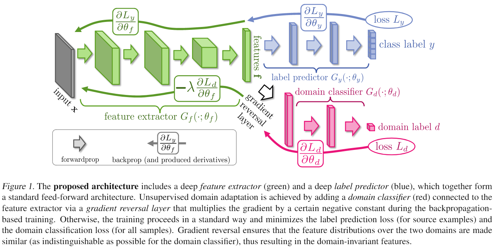

## 概要

UDAの問題設定において，基本的なbackpropで学習させるために**Gradient Reversal Layer (GRL)**を提案．

feature extractorはsourceとtargetで共通．
domain classifierはsourceとtargetの識別誤差を減らそうと学習するが，feature extractorはsourceとtargetのサンプルから得られる特徴量の確率分布が近づくように（識別誤差が大きくなるように）学習する．

GRLはforwardでは恒等写像，backwardでは勾配の符号を反転および$\lambda$によるスケーリングを行う．これはforwardとbackwardが対応していないが，あえてそのような組み合わせにすることでfeature extractorとdomain classifierの学習を同時に行うことができる．GRLを"pseudo-function" $R_\lambda(\mathbf{x})$として定義すると，forwardおよびbackwardは以下のように書ける．

\begin{align}
\mathrm{forward:}& R_\lambda(\mathbf{x}) = \mathbf{x} \newline
\mathrm{backward:}& \frac{d R_\lambda}{d \mathbf{x}} = - \lambda \mathbf{I}
\end{align}

ネットワークアーキテクチャは以下の図の通り．
緑がfeature extractor $G_f$，青がlabel predictor $G_y$，赤がdomain classifier $G_d$に対応している．
$G_f$と$G_d$の間にGRLが接続されている．
ドメインの識別誤差による損失$L_d$はbackpropによって$G_d$のパラメータ$\theta_d$を$L_d$が小さくなるように更新される．
一方，backpropがGRLを通ると勾配の符号が反転しているため，$G_f$のパラメータ$\theta_f$は$L_d$が大きくなるように更新される．

## References

* Yaroslav Ganin, Victor Lempitsky. Unsupervised Domain Adaptation by Backpropagation. ICML2015
