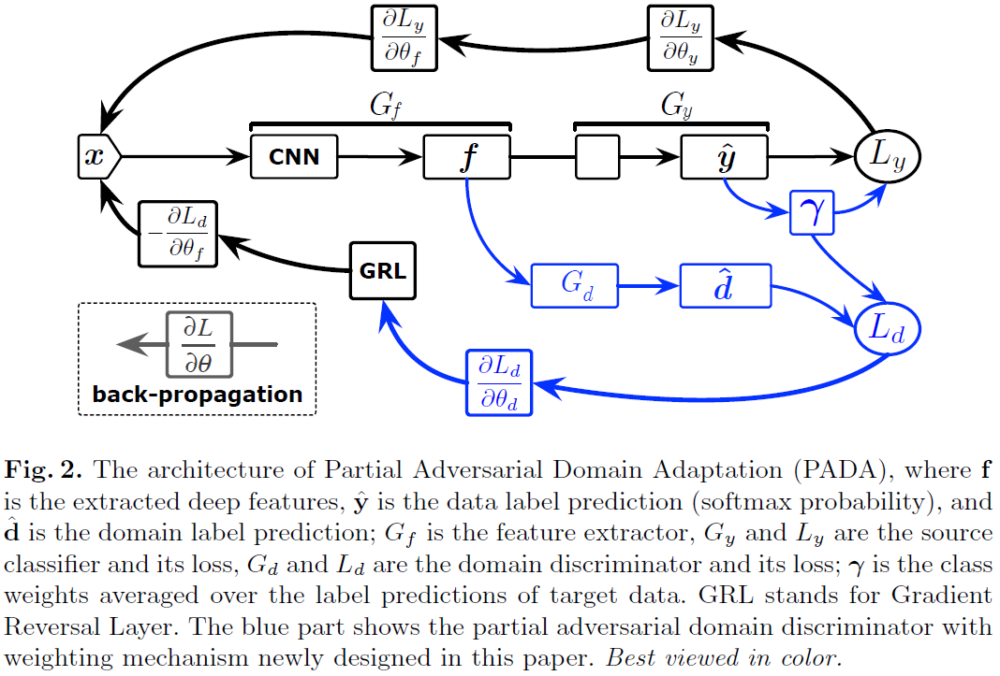

## 概要

DAにおいて，従来はtargetのラベル集合とsourceのラベル集合は一致しているという問題設定で扱われてきた．
本論文では，targetがsourceのラベル集合の部分集合になっているという新たな問題設定を提案する．
このとき，sourceには存在するが，targetに存在しないラベルの影響により，
従来のDAを適用するとnegative transferを引き起こして性能が低下するという課題がある．
上記の課題に対し，targetのサンプルに対するclassifierの出力確率の期待値を重み付け係数として利用するPartial Adversarial Domain Adaptation (PADA)を提案．
本論文におけるDAの新たな問題設定において，良い性能を示した．

## Notations

\begin{equation}
\newcommand{\bx}{\mathbf{x}}
\newcommand{\bgamma}{\boldsymbol{\gamma}}
\newcommand{\argmax}{\mathop{\rm arg~max}\limits}
\newcommand{\argmin}{\mathop{\rm arg~min}\limits}
\end{equation}

* sourceとtargetのラベル集合：$C_s, C_t$
* sourceとtargetのサンプル数：$n_s, n_t$
* sourceのサンプル集合：$D_s = \left\\{(\bx_i^s, y_i^s)\right\\}_{i = 1}^{n_s}$
* targetのサンプル集合：$D_t = \left\\{\bx_i^t\right\\}_{i = 1}^{n_t}$
* 新たな問題設定：$\|C_t\| < \|C_s\|, \;  C_t \subset C_s$

## Domain Adversarial Neural Network (DANN)

まず，従来手法の[GRL](grl.html){:target="_blank"}で用いられたDomain Adversarial Neural Network (DANN)について述べる．DANNのネットワークは以下の3つから構成される．
* feature extractor $G_f$
* domain discriminator $G_d$
* source classifier $G_y$
$G_f, G_d, G_y$はそれぞれ対応するパラメータ$\theta_f, \theta_d, \theta_y$を持つ．
DANNの目的関数は
\begin{align}
    C_0(\theta_f, \theta_y, \theta_d) 
    & = \frac{1}{n_s} \sum_{\bx_i \in D_s} L_y(G_y(G_f(\bx_i)), y_i) \newline
    & - \frac{\lambda}{n_s + n_t} \sum_{\bx_i \in D_s \cup D_t} L_d(G_d(G_f(\bx_i)), d_i)
\end{align}
で表される．$\lambda$はバランスをとるためのハイパーパラメータであり，$d_i$は$\bx_i$がsourceまたはtargetのどちらのドメインであるかを表す2値変数である．
実際には以下の最適化問題を解くことになる．
\begin{align}
    (\hat{\theta}_f, \hat{\theta}_y) &= \argmin\_{\theta_f, \theta_y} C_0(\theta_f, \theta_y, \theta_d) \newline
    (\hat{\theta}_d) &= \argmax\_{\theta_d} C_0(\theta_f, \theta_y, \theta_d)
\end{align}

## Partial Adversarial Domain Adaptation (PADA)

PADAのアイデアは「sourceには存在するがtargetには存在しないラベル集合$C_s \backslash C_t$に含まれるラベルに対する重みを小さくする」ようにできれば良い．以下，このアイデアを明確に述べる．

source classifier $G_y$の出力は$C_s$上のどのラベルであるかの確率を表していると考えられる．
これを利用して，targetのサンプルに対する出力の平均$\bgamma \in \mathbb{R}^{\|C_s\|}$を求める．実用的には平均を求めた後に$\bgamma \leftarrow \bgamma / \max(\bgamma)$などで正規化する．
\begin{align}
    \bgamma = \frac{1}{n_t} \sum_{\bx_i \in D_t} G_y(G_f(\bx_i))
\end{align}
$\bgamma$の意図するところは以下の通りである．
* サンプルのラベルがtargetのラベル集合$C_t$に含まれる場合：$\bgamma$の対応する次元の値は**大きくなるはず**
    * G_yの出力が大きくなることが期待されるから
* サンプルのラベルがtargetのラベル集合$C_t$に含まれない場合：$\bgamma$の対応する次元の値は**小さくなるはず**
    * G_yの出力が小さくなることが期待されるから

よって，$\bgamma$が期待されるような値をとれば，$\bgamma$を重み付け係数として利用することにより，ラベルが$C_t$に含まれない場合の影響を小さくできる．
以上を踏まえて，PADAにおける目的関数は
\begin{align}
    C(\theta_f, \theta_y, \theta_d)
    & = \frac{1}{n_s} \sum_{\bx_i \in D_s} \gamma_{y_i} L_y(G_y(G_f(\bx_i)), y_i) \newline
    & - \frac{\lambda}{n_s} \sum_{\bx_i \in D_s} \gamma_{y_i} L_d(G_d(G_f(\bx_i)), d_i) \newline
    & - \frac{\lambda}{n_t} \sum_{\bx_i \in D_t} L_d(G_d(G_f(\bx_i)), d_i)
\end{align}
となる．DANNからの変更点は，$\bx_i \in D_s$の場合は$\bgamma$による重み付けが行われている点である．最適化問題はDANNと同様に
\begin{align}
    (\hat{\theta}_f, \hat{\theta}_y) &= \argmin\_{\theta_f, \theta_y} C(\theta_f, \theta_y, \theta_d) \newline
    (\hat{\theta}_d) &= \argmax\_{\theta_d} (\theta_f, \theta_y, \theta_d)
\end{align}
である．

PADAのアーキテクチャを以下に示す．
[GRL](grl.html){:target="_blank"}のアーキテクチャと比較すると$\bgamma$が変更点になっていることが明確に分かる．

## References

* [Zhangjie Cao, Lijia Ma, Mingsheng Long, Jianmin Wang; Partial Adversarial Domain Adaptation. The European Conference on Computer Vision (ECCV), 2018, pp. 135-150](http://openaccess.thecvf.com/content_ECCV_2018/html/Zhangjie_Cao_Partial_Adversarial_Domain_ECCV_2018_paper.html){:target="_blank"}
* [official implementation (pytorch)](https://github.com/thuml/PADA){:target="_blank"}