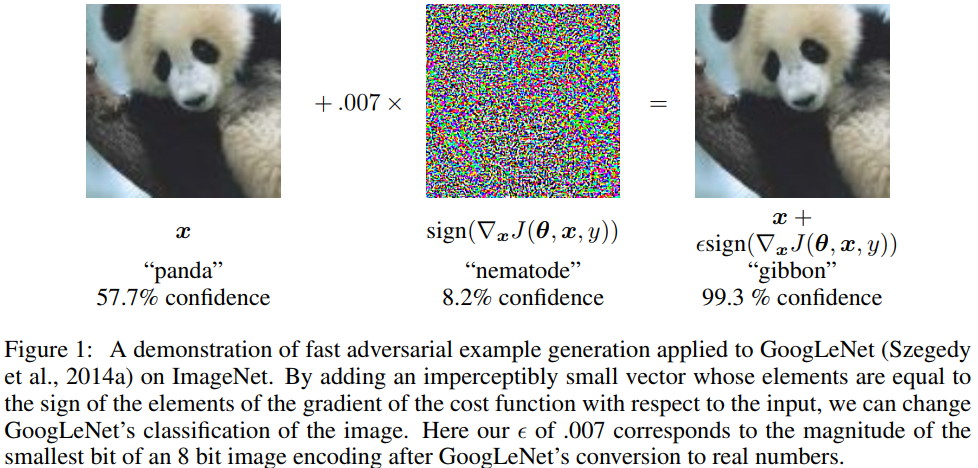
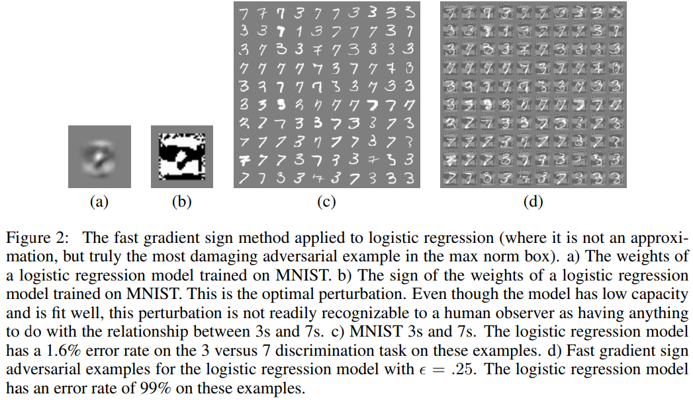

Adversarial Example関連の論文を全く読んでいなかったので，パンダが例として出てくる論文を眺めることにした．
読めていない箇所もかなりあるが，FGSMの概要は把握できたと思うのでメモとして残しておく．

## 概要

本論文では，損失関数の入力変数についての勾配を符号を利用する
**Fast Gradient Sign Method (FGSM)**を提案している．
また，FGSMの提案の過程で，単純な線形モデルであってもadversarial exampleを
引き起こすことが可能であることが説明されている．

## 線形モデルにおけるAdversarial Examples

\begin{equation}
\newcommand{\bfx}{\boldsymbol{x}}
\newcommand{\bfw}{\boldsymbol{w}}
\newcommand{\bfeta}{\boldsymbol{\eta}}
\newcommand{\bftheta}{\boldsymbol{\theta}}
\newcommand{\dataexp}{\mathbb{E}\_\{\bfx, y \sim p_{\mathrm{data}}\}}
\end{equation}

まず，単純な線形モデルでadversarial exampleがどうやって引き起こされるか，について考える．
例えば，画像は基本的に1 channelに対して8bitで表現されるため，ダイナミックレンジの1 / 255
未満の変化は精度の問題から切り捨てられている（補足：センサが取りうる値の範囲がダイナミックレンジ）．ここで，精度によって切り捨てられるほど小さい摂動$\bfeta$を入力$\bfx$に加えたadversarial input$\tilde{\bfx} = \bfx + \bfeta$を考える．ただし$\bfeta$は
精度の問題で切り捨てられるほど十分に小さな値$\epsilon$に対して$\||\bfeta\||_{\infty} = \max{\bfeta} < \epsilon$とする．このとき重みベクトル$\bfw$との内積は
\begin{align}
    \bfw^T \tilde{\bfx} = \bfw^T \bfx + \bfw^T \bfeta
\end{align}
である．すると内積は$\bfeta$を加えたことにより，$\bfw^T \bfeta$だけ変化させることができる．
$\bfeta$のmax norm constraint下において，上式を最大化するような$\bfeta$は$\bfeta = \mathrm{sign}(\bfw)$である．例えば，$\bfw$が$n$次元ベクトルであり，L2ノルムの要素数に対する平均を$m$とすると，結果として$\bfeta$を加えることで$\epsilon m n$変化させることができる．

よって，重みベクトルの次元数$n$に対して線形に大きくなる．
以上の考えから，線形モデルであっても十分に次元数が大きければ，摂動$\bfeta$によって識別結果を
変化させるようなadversarial input$\tilde{\bfx}$を生成することが可能だと考えられる．

## Fast Gradient Sign Method (FGSM)

neural network (NN)は「線形的すぎる」ので上記の線形モデルにおけるlinear adversarial perturbation
に対抗できないだろう，と著者らは仮説を立てている．
LSTMやReLUなどは意図的に線形に振る舞うように設計されており，またsigmoidでもsaturateしていない線形の領域にとどまるように注意深くチューニングされている．
このような線形の振る舞いから、NNは線形モデルにおける摂動が影響を与えられることを示唆している．

NNのモデルのパラメータを$\bftheta$，入力を$\bfx$，出力を$y$に対応する出力とする．
損失関数を$J(\bftheta, \bfx, y)$とすると，max norm constraint下で最適な摂動は
\begin{align}
    \bfeta = \epsilon \mathrm{sign}(\nabla_{\bfx} J(\bftheta, \bfx, y))
\end{align}
となる．以上の手法をFast Gradient Sign Method (FGSM)と呼ぶことにする．
勾配はbackpropによって効率的に求めることが可能である．

ImageNetで学習したGoogLeNetに対してFGSMを適用した例を図1に示す．
図1ではFGSMによって"panda"を"gibbon"と誤認識させることに成功している．

## 例：ロジスティック回帰におけるFGSM

例として，厳密にFGSMが求まるロジスティック回帰を見ていく．
ラベルが$y \in \left\\{-1, 1\right\\}$，$P(y = 1) = \sigma(\bfw^T \bfx + b)$とする．
ただし$\sigma(z) = 1 / (1 + \exp(-z))$はシグモイド関数である．
このとき，目的関数は
\begin{align}
    L(\bftheta, \bfx, y) = \dataexp \left[ \zeta(-y(\bfw^T \bfx + b)) \right]
\end{align}
である．ただし，$\zeta(z) = \log (1 + \exp(z))$はsoftplus関数である．
ここから，入力に関する勾配の符号$\mathrm{sign}(\nabla_{\bfx} J(\bftheta, \bfx, y)) = - \mathrm{sign}(\bfw)$が得られる．したがって，$\bfw^T \mathrm{sign}(\bfw) = \||\bfw\||_1$
を用いると，FGSMを適用したときの最小化したい目的関数は
\begin{align}
    L\_{\mathrm{FGSM}}(\bftheta, \bfx, y) 
    &= \dataexp \left[ \zeta(-y(\bfw^T (\bfx + \bfeta) + b)) \right] \newline
    &= \dataexp \left[ \zeta(y(\epsilon \||\bfw\||_1  - \bfw^T \bfx - b)) \right]
\end{align}
となる．

このロジスティック回帰を適用した結果を図2に示す．
MNISTの3と7の2クラスのみを抽出してFGSMをロジスティック回帰に適用している．
通常のロジスティック回帰ではerror rateが1.6%だったのに対し，
FGSMではerror rateが99%になっている．

### 補足：シグモイド関数とsoftplus関数の関係

式(8)から式(9)の導出が目的．

\begin{align}
    I(y, c) = \left\\{ \begin{array}{l}
        1 \quad (y = c) \newline
        0 \quad (otherwise)
    \end{array} \right.
\end{align}
とする．このとき，ロジスティック回帰の目的関数は
\begin{align}
    L(\bftheta, \bfx, y) 
    &= - \dataexp \left[ I(y, 1) \log \sigma(\bfw^T \bfx + b) + I(y, -1) \log \left(1 - \sigma(\bfw^T \bfx + b) \right) \right] \newline
    &= \dataexp \left[ \zeta(-y(\bfw^T \bfx + b)) \right]
\end{align}
と変形できる．

上記のシグモイド関数からsoftplus関数への変形を導出する．表記をわかりやすくするために$u = \bfw^T \bfx + b$とする．式(8)の大かっこ内について

$(\mathrm{i}) \quad y = 1$のとき
\begin{align}
    - \log \sigma(u)
    = - \log \left( \frac{1}{1 + \exp(-u)} \right) = \log (1 + \exp(-u)) = \zeta(-u) = \zeta(-yu)
\end{align}
$(\mathrm{ii}) \quad y = -1$のとき
\begin{align}
    - \log \left(1 - \sigma(u) \right)
    &= - \log \left(1 - \left( \frac{1}{1 + \exp(-u)} \right) \right)
    = - \log \left(\frac{\exp(-u)}{1 + \exp(-u)} \right) \newline
    &= - \log \left(\frac{1}{\exp(u) + 1} \right)
    = \log (1 + \exp(u)) = \zeta(u) = \zeta(-yu)
\end{align}
となる．したがって，一般に
\begin{align}
    \left\\{ \begin{array}{l}
        - \log \sigma(u) = \zeta(-u) \newline
        - \log (1 - \sigma) = \zeta(u)
    \end{array} \right.
\end{align}
が成り立つ．

### 補足：ロジスティック回帰における勾配の符号の導出

式(4)における$\mathrm{sign}(\nabla_{\bfx} L(\bftheta, \bfx, y))$を求める．
\begin{align}
    \mathrm{sign}(\nabla_{\bfx} L(\bftheta, \bfx, y))
    &= \mathrm{sign}\left(\nabla_{\bfx} \dataexp \left[ \zeta(-y(\bfw^T \bfx + b)) \right] \right) \newline
    &= \mathrm{sign} \left( \nabla_{\bfx} \zeta(-y(\bfw^T \bfx + b)) \right) \newline
    &= \mathrm{sign} \left( \nabla_{\bfx} \log (1 + \exp \left(-y(\bfw^T \bfx + b)) \right) \right) \newline
    &= \mathrm{sign} \left(\frac{\exp \left(-y(\bfw^T \bfx + b)\right)}{1 + \exp \left(-y(\bfw^T \bfx + b)\right)} \nabla_{\bfx} (-y(\bfw^T \bfx + b)) \right) \newline
    &= \mathrm{sign} \left(\underset{> 0}{\underline{\frac{\exp \left(-y(\bfw^T \bfx + b)\right)}{1 + \exp \left(-y(\bfw^T \bfx + b)\right)}} (-y \bfw)} \right) \newline
    &= - y \mathrm{sign}(\bfw)
\end{align}
となる．ただし，$y$については符号を考慮していない(式(5)と式(6)を参照)．以上より
\begin{align}
    \bfeta = \epsilon \mathrm{sign}(\nabla_{\bfx} L(\bftheta, \bfx, y)) = - \epsilon \mathrm{sign}(\bfw)
\end{align}
である．